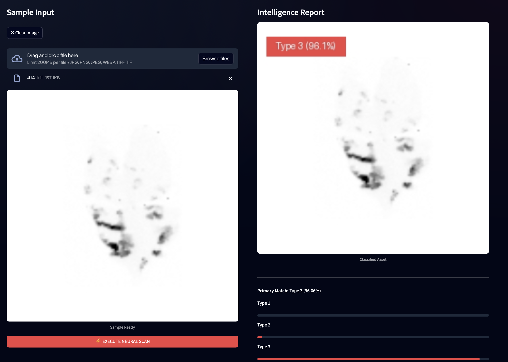

# 🌿 Ebio-Net 

A powerful, high-performance AI classification pipeline for detection and monitoring of disease types and spread. This application leverages an optimized **EfficientNet** neural engine to provide industrial-grade plant type identification with 90%+ target accuracy.



## 🚀 Key Features

*   **Precision Neural Scan**: High-fidelity analysis for single plant leaves with automated image labeling.
*   **Mass Pipeline Processing**: Bulk classification via folder path input or manual multi-file upload.
*   **Visual Data Proofing**: Every analyzed asset is generated with a burned-in classification tag (Type & Confidence %).
*   **Comprehensive Telemetry**: Export detailed prediction matrices for every file in a dataset to the standard CSV format.
*   **Luxury Enterprise UI**: A modern, glassmorphic interface designed for clarity and professional presentation.

## 🛠️ Quick Start Guide

### 0. Get the App
Clone the repository and navigate into the App folder:
```bash
git clone https://github.com/Saiful366/Ebio-Net.git
cd Ebio-Net/App
```
> Or download the ZIP from GitHub and open the `App` folder in your terminal.

### 1. Environment Setup
Create and activate a dedicated conda environment (Python 3.11 recommended for TensorFlow compatibility):
```bash
conda create -n modelapp python=3.11
conda activate modelapp
pip install -r requirements.txt
```

### 2. Launching the Engine
Execute the following command to boot the local analysis server:
```bash
streamlit run app.py
```
The application will launch at `http://localhost:8501`.

## 💻 Operational Modes

### 🎯 Precision Analysis (Single)
1. Navigate to the **PRECISION SCAN** tab.
2. Select or drop a high-resolution leaf sample.
3. Click `EXECUTE NEURAL SCAN`.
4. Review the **Intelligence Report** featuring annotated visual proof and the full probability map.

### 🚀 Batch Pipeline (Folder or Upload)
1. Navigate to the **BATCH PIPELINE** tab.
2. **Option A — Directory Path**: Paste the full local folder path (e.g. `/Users/saiful/Downloads/images`) into the directory input field and click `CONFIRM DIRECTORY`.
3. **Option B — Manual Upload**: Select multiple images using the file uploader.
4. Click `START PIPELINE PROCESSING` to begin the mass-scan.
5. Download the consolidated **CSV Report** once the progress bar reaches 100%.

## 📁 System Architecture
*   `app.py`: Main application core and UI controller.
*   `restored_best_model_88.keras`: The optimized Deep Learning weight file.
*   `requirements.txt`: Dependency specifications.
*   `README.md`: This technical documentation.

## ⚠️ Engine Specifications
*   **Neural Core**: Keras Optimized EfficientNetB0
*   **Input Resolution**: 224x224 (Auto-Standardized)
*   **Preprocessing**: Neural Spectral Normalization (v3.6)
*   **Classification Depth**: 6 Distinct Plant Types
*   **Python**: 3.11 (conda environment: `modelapp`)

---
*© 2026 Ebio-Net Systems • v3.6 Industrial Core*
